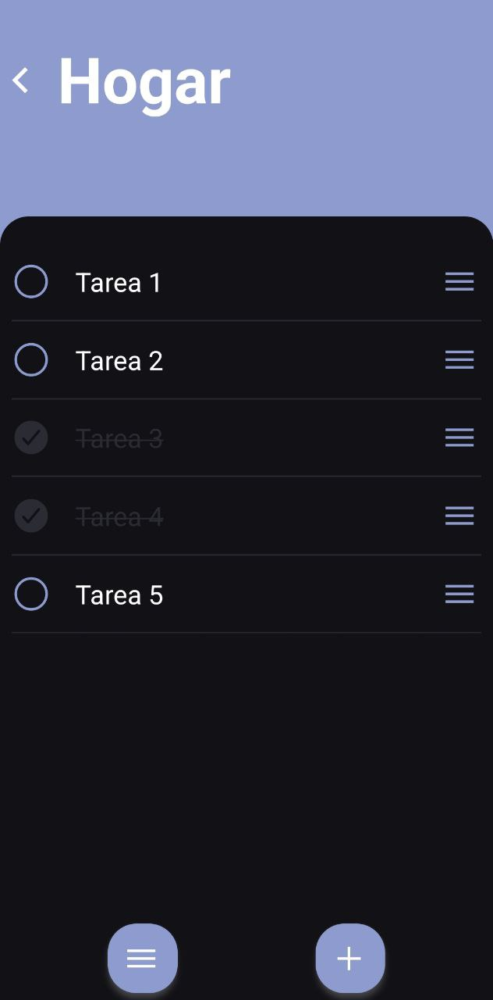
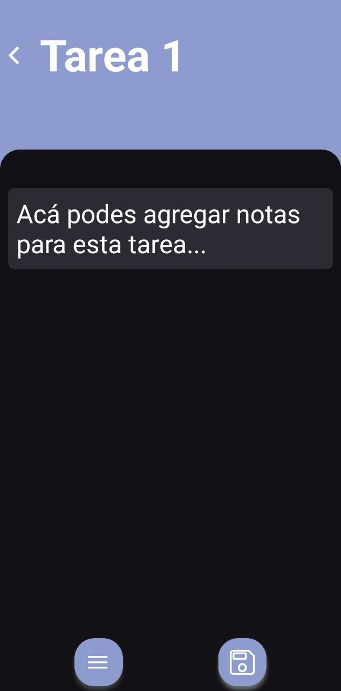
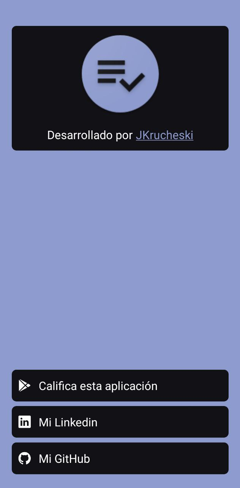

# To-Do List

Simple todo list application programmed with React Native. This App uses:

- MongoDB Realm for storage.
- React Native Reanimated for animations.
- React Navigation for navigationcontrol.

You can download it from [Google Play](https://play.google.com/store/apps/details?id=com.jonathankrucheski.todolist).

I only compiled it for Android but you can try to compile it also for iOS.

## Screenshots

    
    
    

    
    

## Next Steps

- [x] Add language support.
- [ ] Add data backup options.
- [x] Add customization support.
- [ ] Add tests.
